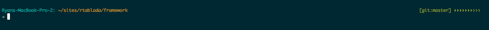

# Getting to Know Your Shell

Through this course, we've installed ZSH and a "robby-russel" theme for our shell.
This has given us a lot of power, but we need to make sure we can harness that power.
So, let's review some things that will save a ton of time when working from the terminal.

## What's All This Mean

With the robby-russel theme there's a lot of information going on so let's break it down:

* `Ryans-Macbook-Pro-2:` (turquoise) - Current User
* `~/sites/rtablada/framework` (yellow) - Working Directory (result of `pwd`)
* `[git:master]` (green) - Git status (Clean - no uncommitted or untracked changes)
* arrows (green, yellow, or red) - Battery status

## A Note About Git status

The git status in our shell will show us if we are in a git project.
This information will change from a green `[git:master]` to a red `+[git:master]` if we have changes that have not been committed.

> **NOTE** This git status does not say anything about if our current branch is in sync with the git remote

## Exiting Out of Long Running Processes

When working in the terminal, there may be times that we do not see the normal shell prompt.
This usually means we are currently running a long running process.
To end these processes, try these steps:

* `CTRL+C` - Standard exit code - Works on most processes
* `CTRL-D` - Heightened exit code - Exits from shells, or REPL applications (`node` with no arguments for example)
* `q` - Quit for `less` and similar read only processes
* `:q!` - Quit for `vi`

Trying these different exit codes and strings will help get us to a normal shell prompt again.
When in doubt, we can always use `CMD+T` or `CMD+D` to open a new prompt in our current directory.
