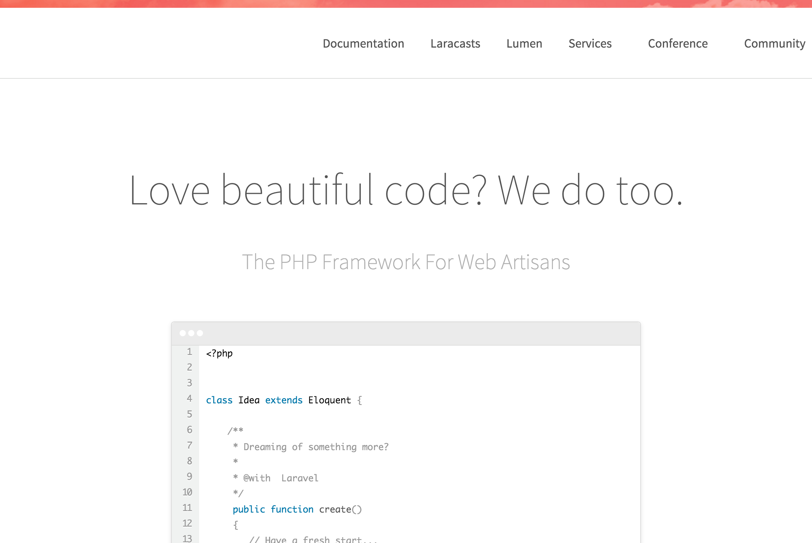
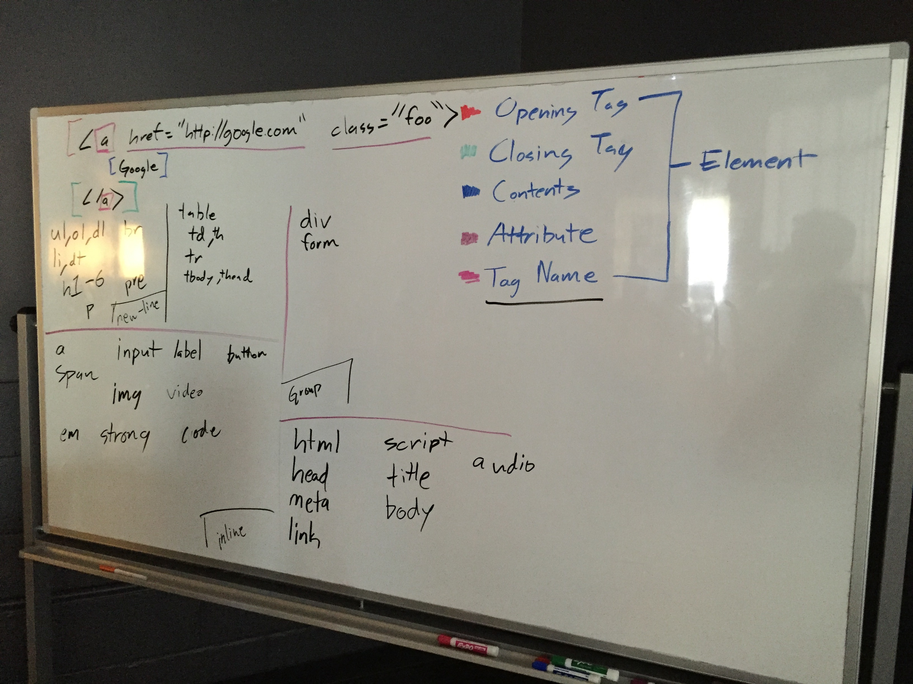

# Monday February 29


## Daily JS

Variable assignment and primitive data types

```js
var x = 1;
var y = 'abc';
var z = true;
var a = x;
x = 2;

console.log(x);
console.log(y);
console.log(z);
console.log(a);

/* Results */
// 2
// "abc"
// true
// 1
```

## Topics

- [HTML Elements and Attributes](html.html)
- [Boilerplate Valid HTML](boilerplate.html)
- [Common HTML Elements](elements.html)
- [Periodic Table of (HTML) Elements](../../resources/html/table-of-elements.html)
- [Basic CSS Selectors](selectors.html)
- [Basic CSS Properties](properties.html)
- [Git Basics](git.html)

## Inspiration

### Laravel Home Page (ish)

[](./laravel.png)

### Whiteboards




## Lab

- House Keeping
  - Do Not Disturb Mode
  - Keyboard Stuff
  - Seat Swapping
- [Homework Process](homework.html)
- Example Homework

## Homework

https://github.com/TIY-TN-FEE-2016-spring/assignments/tree/master/01-html-introduction
