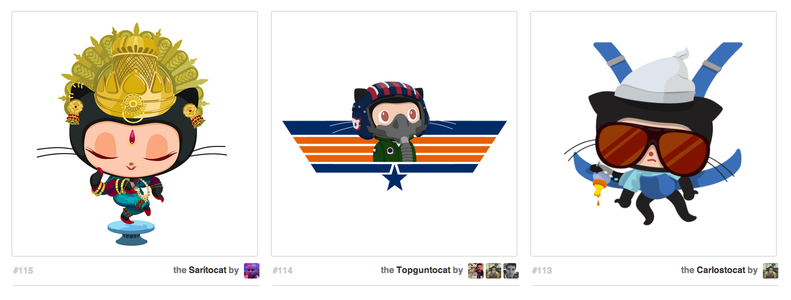

# Thursday March 3

## Daily JS

Arrays and Objects (all ES6 like)

```js
var x = [1, 2, 3];
var y = [1, 2, 3];
var z = [x, y];
var a = {'something': x, another: 'hello'};
var b = {x, y};
var c = {x, y};
var d = c;

console.log(x === y);
console.log(x == y);
console.log(x[0]);
console.log(y[0] === x[0]);
console.log(z[0] === x);
console.log(a.another);
console.log(a['something']); // How far does it go?
console.log(b === c);
console.log(c === d);

/* Results (Printed statements from console.logs) */
//
//
//
//
//
//
//
//
//
```

## Topics

* House Keeping
  - Importance of Assignments
    * Portfolio
* **[`vh` and `vw` Units](https://css-tricks.com/the-lengths-of-css/#article-header-id-12)**
* [Flex Box](flex-box.html)
  - Flex Parent vs Flex Children `display: flex`
  - `flex-direction` (Parent)
    * Primary Axis
  - `flex-basis`, `flex-grow`, `flex-shrink` (Child)
  - `flex-wrap` (Parent)
* **[Moving Flexbox Content](https://css-tricks.com/snippets/css/a-guide-to-flexbox/)**
  - `justify-content` vs `align-items` (Parent)
  - `align-content` (Parent)
  - `align-self` (Child)
* **Flexbox Patterns**
  - Sticky Footer

* [Breaking Down a Layout](layout-planning.html)
* [Layout Techniques](layout-tricks.html)

## Inspiration

### Octocat Grid

[](./octodex.png)

### Tumblr Splash Page

[](./tumblr.png)

## Exercise & Lesson Code

https://github.com/TIY-TN-FEE-2016-spring/lesson-01-04

## Lab

### Video

[Content Driven Layouts with Flexbox](https://youtu.be/R53ehAOaVpk)

### Exercise

[Flexbox Froggy](http://flexboxfroggy.com/)

## Homework

https://github.com/TIY-TN-FEE-2016-spring/assignments/tree/master/04-surf-and-paddle

## Resources

* [Common Device Sizes](https://css-tricks.com/snippets/css/media-queries-for-standard-devices/)
* Typographic Grid
