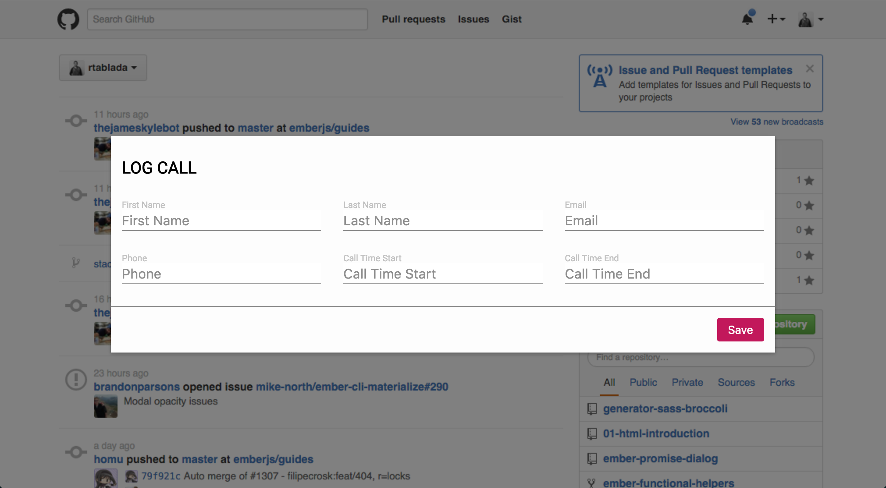

# Tuesday March 15

## Interruptions & Events

* 12:30-1:30 Meeting

## Daily JS

### A word about Prototypes

### JS Quiz

#### Instructions

Given the code below, write code to make the `digitize` function work.
The function should perform the following:

* Given a non-negative integer, return an array / a list of the individual digits in order.

Slack me a direct message of your attempt.

#### Methods to Look Up

* Number.prototype.toString()
* String.prototype.split

```js
function digitize(n) {
  const chars = n.toString();
  const collect = [];

  for (var i = 0; i < chars.length; i++) {
    collect.push(parseInt(chars[i]));
  }

  return collect;
}

console.assert(digitize(123)[0] === 1); // Checks that the first item in an array returned by `digitize(123)` is a number 1
console.assert(digitize(8675309)[6] === 9); // Checks that the item in position 6 of an array returned by `digitize(8675309)` is a number 9
```

## Topics

- [Variable Scope](scope.html)
- [Hoisting and Variables](hoisting.html)
- [Objects and Classes](classes.html)
- [Types of Functions](function-types.html)

## Lab

## Assignment 05 Updates

The designer for exercise 5 realized that they gave you the wrong brand standards.

Replace the values for the new brand standards:


```
$gutter: 1rem;
$haze: rgba(0, 0, 0, 0.5);
$brand-primary: #c2185b;
$brand-white: #fdfdfd;
$brand-grey: #8e8e8e;
$brand-light-grey: lighten($brand-grey, 20%);
$brand-border: 0.1rem solid $brand-grey;
$brand-shadow: 0 2px 5px 0 rgba(0, 0, 0, 0.16), 0 2px 10px 0 rgba(0, 0, 0, 0.12);
```

Things should look like:



## Code

https://github.com/TIY-TN-FEE-2016-spring/lesson-03-02

## Homework

https://online.theironyard.com/library/paths/91/units/740/assignments/1299
